# Animal-Recognition

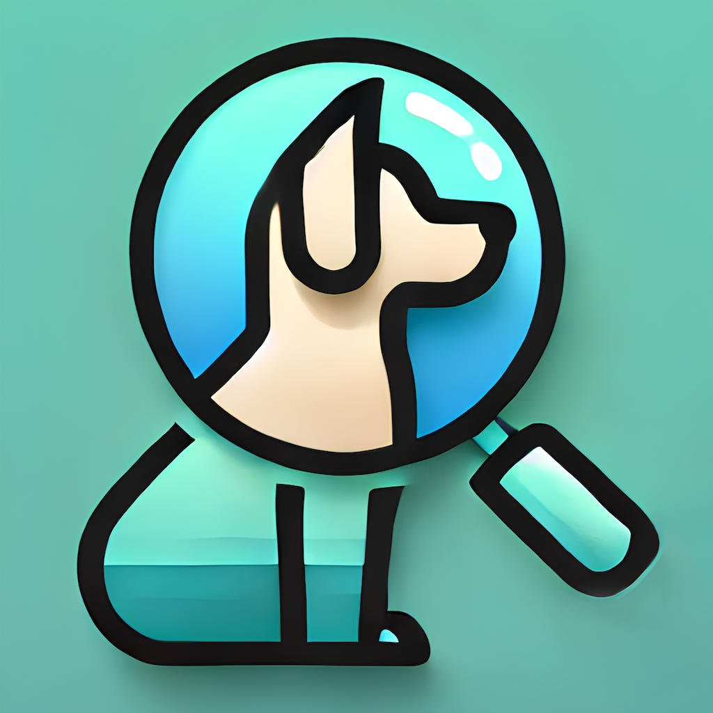

An Initial iOS project developed by Swift and SwiftUI to recognize animals.

## Background
My graduation project is "Development of an AI-Powered Mobile Application for Animal Identification and Information". I am developing a mobile software that can identify animals. After communicating with my tutor, I plan to use Yolo as the deep learning recognition model. The mobile software will be developed using native iOS, that is, using Swift+SwiftUI on XCode for iOS development. I have always been interested in iOS development, so I’d like to take this opportunity to learn about native iOS development.

## Development Log
- [Swift + SwiftUI原生iOS开发 开发笔记1 – 实现摄像头调用和拍摄图片](https://shenyifan.home.blog/2024/11/17/swift-swiftui原生ios开发-开发笔记1-实现摄像头调用和拍摄图/)
- [Swift + SwiftUI原生iOS开发 开发笔记2 – 使用YOLOv3n模型对画面进行识别](https://shenyifan.home.blog/2024/11/24/swift-swiftui原生ios开发-开发笔记2-使用yolov3n模型对画面进行识/)
- [Swift + SwiftUI原生iOS开发 开发笔记3 – 自主模型部署并获取识别结果](https://shenyifan.home.blog/2025/04/06/swift-swiftui原生ios开发-开发笔记3-自主模型部署并获取识别/)
- [Swift + SwiftUI原生iOS开发 开发笔记4（1.0.0最终） – 识别结果信息详情 + 页面美化 + 总结](https://shenyifan.home.blog/2025/04/13/swift-swiftui原生ios开发-开发笔记4（1-0-0最终）-识别结果信/)

## Development


### Dataset Selection
The dataset I selected is [Open Images V7 Animals YOLO](https://www.kaggle.com/datasets/sergiomoy/open-imagea-v7-animals-yolo) which contains 50,000 images of 11 classes of animals.

the most reason I chose this dataset is that it has yolo format lable, but until I finished the training, I found that the dataset is not very good, it's very unbalanced, as the following image shows, nearly 27,000 images of "Dog" but other average is 2000, but I still try to train the model, let's see the result.


### Model Training
I trained the model using [YOLO11m](https://docs.ultralytics.com/models/yolo11/) which is latest version of YOLO, and I used the default parameters for training, set epochs to 200, I didn't validate the overfitting problem.
```bash
python train.py --img 640 --batch 16 --epochs 200 --data data.yaml --weights yolov8n.pt
```

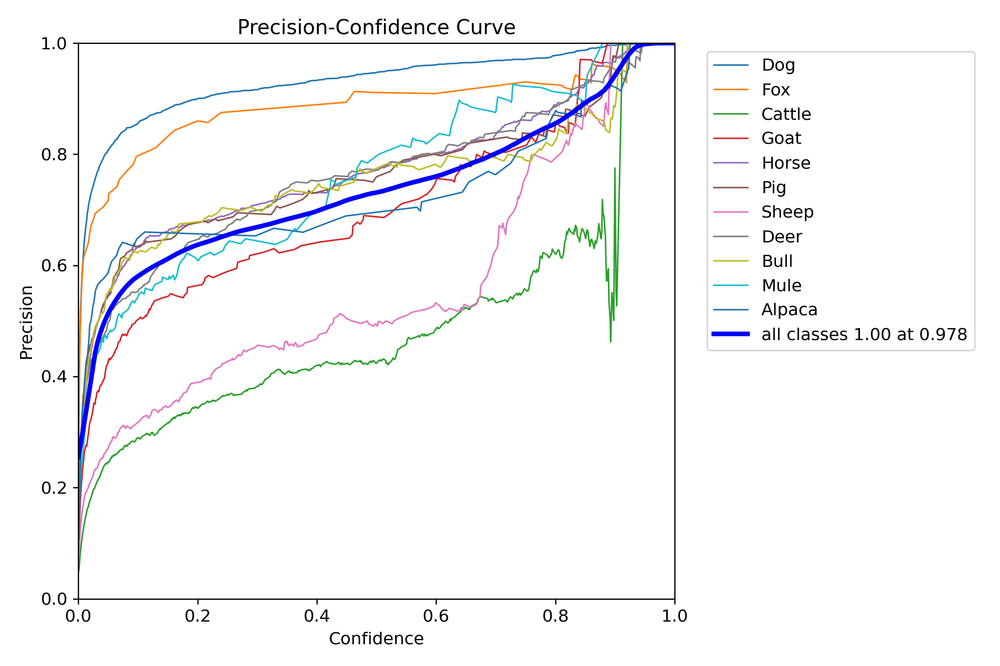
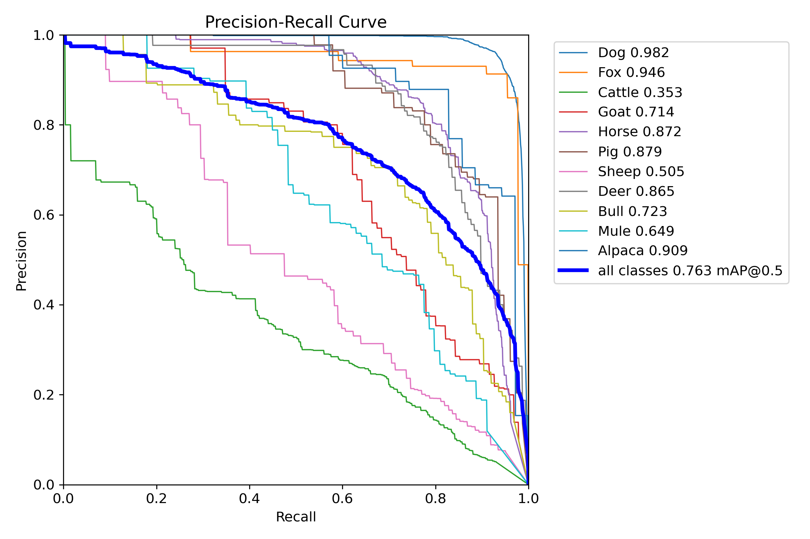
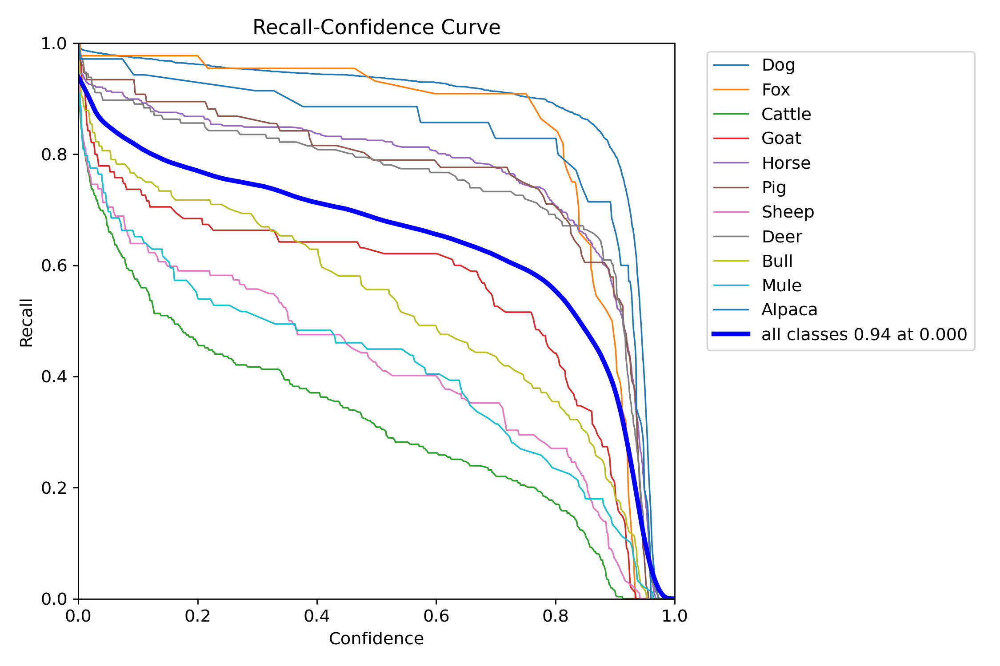
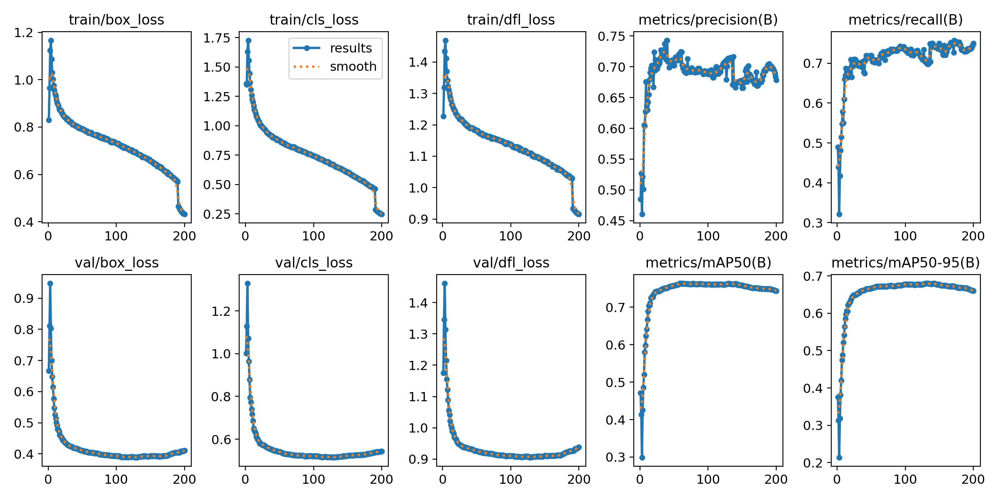
After training, I got the best.pt model, and I used the best.pt model to test the dataset, and the result is as follows:

#### validation dataset result

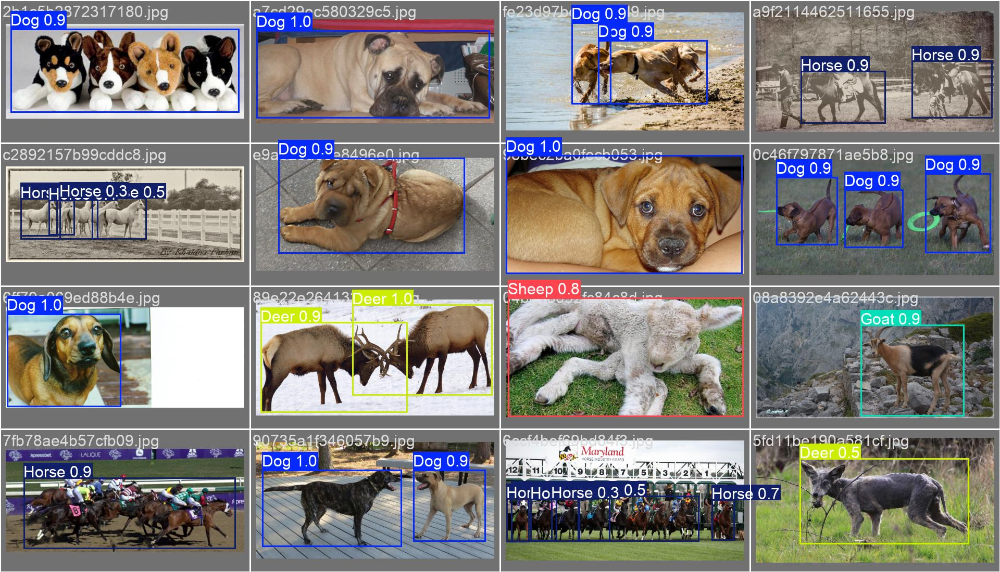
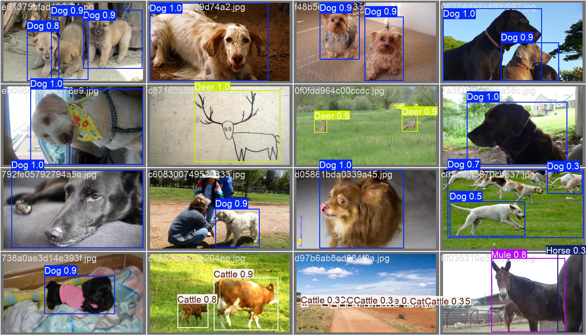

#### .pt model performance

The system show blow the picture is this model embedded in my little sys which is auto inferencing the image from system camera.

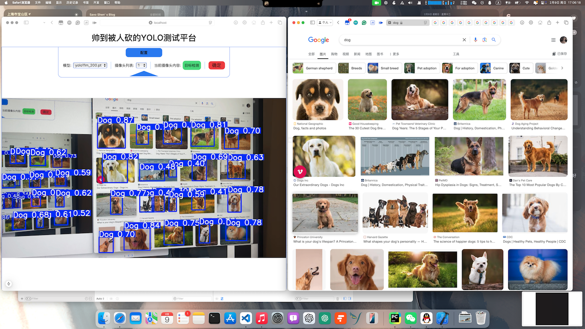

### CoreML Model Export
Beacuse I want to deploy the model on iOS, I need to export the model to CoreML format, and I follow [the command from offical tutorial](https://docs.ultralytics.com/integrations/coreml/) to export the model:
```python
from ultralytics import YOLO

# Load the YOLO11 model
model = YOLO("yolov11m.pt")

# Export the model to CoreML format
model.export(format="coreml", nms=True)  # creates 'yolo11n.mlpackage'
```

After exporting, I got a .mlpackage file, and I used the file to test the model on iOS, and the result is as follows:

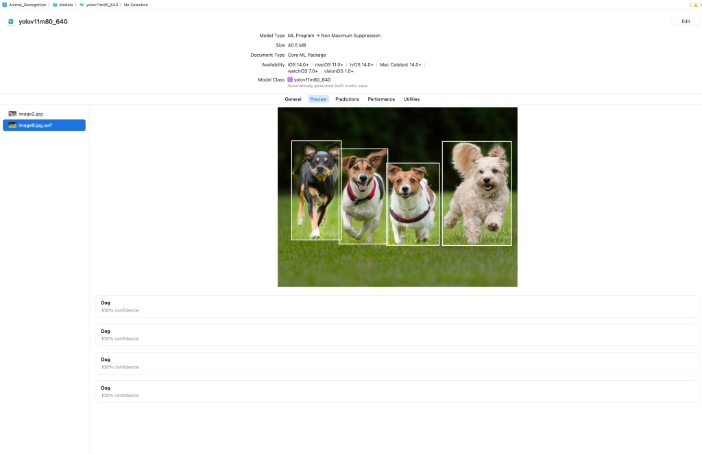
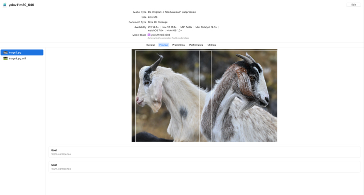

### CoreML Model Deployment
The program detail avaliable [development log](#development-log)

The result is as follows:

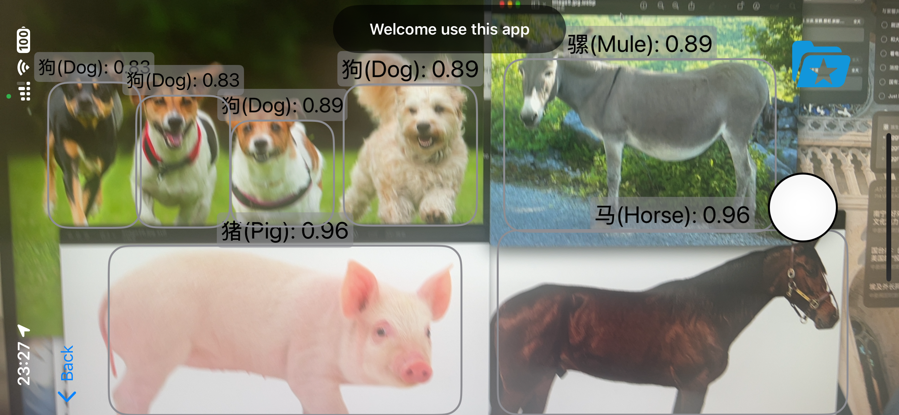

## Installation
1. Clone the repository
```bash
git clone https://github.com/Savo-Shen/Animal-Recognition
```

2. Open the project in Xcode

3. Connect your iOS device to your computer

4. Select your device as the target device in Xcode

5. Click the "Run" button in Xcode to build and run the app on your device

## Use
1. Open the app on your iOS device

2. Allow the app to access your camera

3. Point the camera at an animal and wait for the app to recognize it (Remember follow the instruction in the app, **TRUN YOUR PHONE**)

## Contact
If you have any questions or suggestions, please feel free to contact me [My Email](mailto:savo_shen@qq.com) or [My Blog](https://shenyifan.home.blog/).