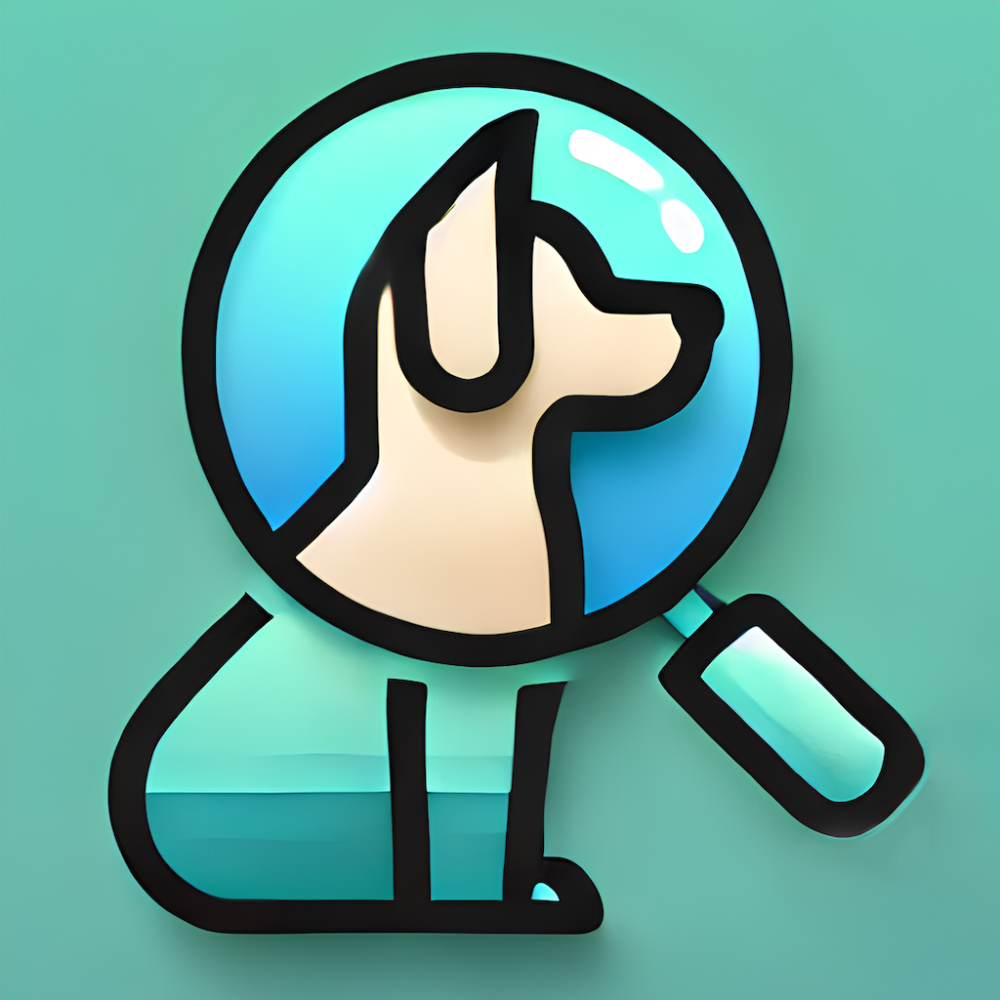
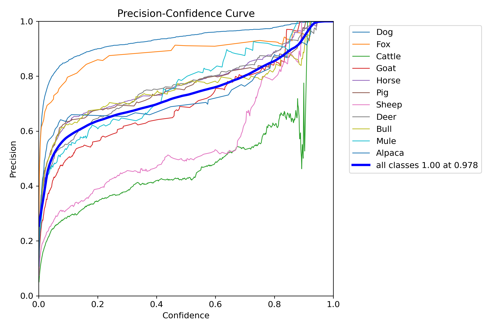
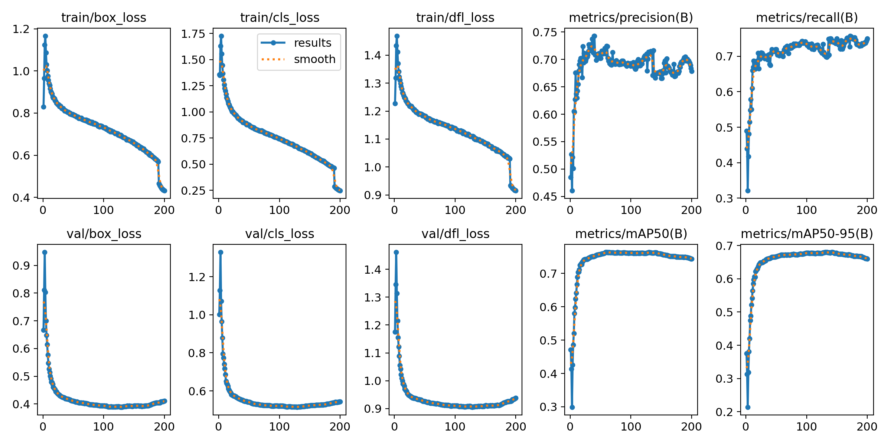
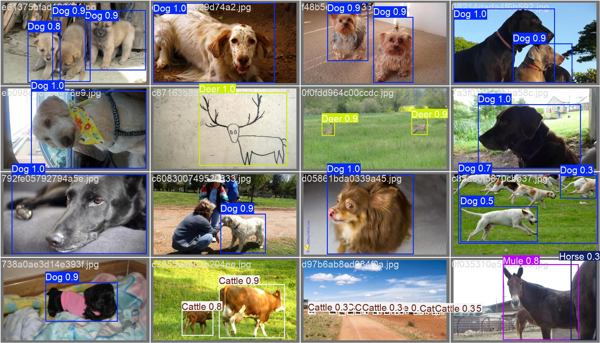
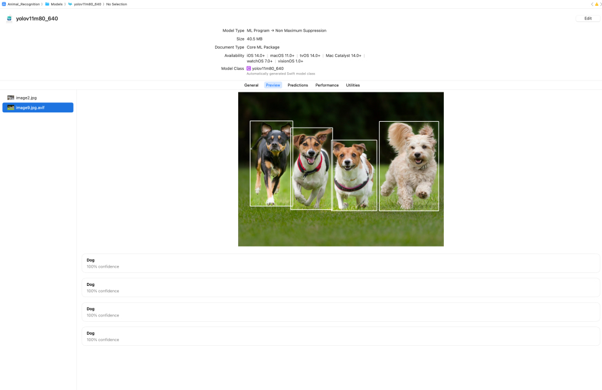

# 基于iOS的YOLO11m动物识别



## 背景
我的毕业设计是《Development of an AI-Powered Mobile Application for Animal Identification and Information》，开发一个可以识别动物的移动软件，在跟导师沟通后打算用Yolo作为深度学习识别模型，移动端软件使用原生的iOS开发，即在XCode上使用Swift+SwiftUI进行iOS开发，原本就一直对iOS开发很感兴趣，借这次机会好好学习一下原生的iOS开发。

## 开发日志
- [Swift + SwiftUI原生iOS开发 开发笔记1 – 实现摄像头调用和拍摄图片](https://shenyifan.home.blog/2024/11/17/swift-swiftui原生ios开发-开发笔记1-实现摄像头调用和拍摄图/)
- [Swift + SwiftUI原生iOS开发 开发笔记2 – 使用YOLOv3n模型对画面进行识别](https://shenyifan.home.blog/2024/11/24/swift-swiftui原生ios开发-开发笔记2-使用yolov3n模型对画面进行识/)
- [Swift + SwiftUI原生iOS开发 开发笔记3 – 自主模型部署并获取识别结果](https://shenyifan.home.blog/2025/04/06/swift-swiftui原生ios开发-开发笔记3-自主模型部署并获取识别/)
- [Swift + SwiftUI原生iOS开发 开发笔记4（1.0.0最终） – 识别结果信息详情 + 页面美化 + 总结](https://shenyifan.home.blog/2025/04/13/swift-swiftui原生ios开发-开发笔记4（1-0-0最终）-识别结果信/)

## 开发


### 数据集选择
我选择的数据集是[Open Images V7 Animals YOLO](https://www.kaggle.com/datasets/sergiomoy/open-imagea-v7-animals-yolo)，包含11类动物的50,000张图片。

我选择这个数据集的原因是它有yolo格式的标签，但是直到我完成训练，我发现数据集不是很好，它非常不平衡，如下图所示，近27000张“狗”的图片，但其他平均只有2000张，但我还是尝试训练模型，看看结果。


### 模型训练

我使用[YOLO11m](https://docs.ultralytics.com/models/yolo11/)训练模型，这是最新版本的YOLO，我使用默认参数进行训练，将epochs设置为200，我没有验证过拟合问题。
```bash
python train.py --img 640 --batch 16 --epochs 200 --data data.yaml --weights yolov8n.pt
```






训练后，我得到了best.pt模型，并使用best.pt模型测试数据集，结果如下：

#### 验证数据集结果




#### .pt模型性能

系统显示下面的图片是这个模型嵌入在我的小系统中，自动推断系统摄像头中的图像。


### CoreML模型导出
因为我想在iOS上部署模型，所以我需要将模型导出为CoreML格式，我按照[官方教程中的命令](https://docs.ultralytics.com/integrations/coreml/)导出模型：
```python
from ultralytics import YOLO

# Load the YOLO11 model
model = YOLO("yolov11m.pt")

# Export the model to CoreML format
model.export(format="coreml", nms=True)  # creates 'yolo11n.mlpackage'
```

成功导出后，生成了一个名为yolo11m.mlpackage的文件，接下来就可以嵌入到我的iOS项目中，在XCode中可以对mlpackage进行预览，结果如下：




### CoreML模型部署
程序细节可参考[开发日志](#开发日志)

识别结果如下：


## 安装
### 1. 克隆代码库
```bash
git clone https://github.com/Savo-Shen/Animal-Recognition
```

### 2. 在Xcode中打开项目

### 3. 将iOS设备连接到计算机

### 4. 在Xcode中选择您的设备作为目标

### 5. 点击Xcode中的“运行”按钮，在设备上构建并运行应用程序

## 使用

### 1. 在iOS设备上打开应用程序

### 2. 点击“拍照”按钮拍摄照片

### 3. 点击“识别”按钮识别照片中的动物(记得把手机倒过来)

### 4. 点击“信息”按钮查看识别结果的详细信息

## 贡献
如果你有任何问题或建议，请随时通过[邮箱](mailto:savo_shen@qq.com)或者[我的博客](https://shenyifan.home.blog/)联系我，我会尽快回复你。